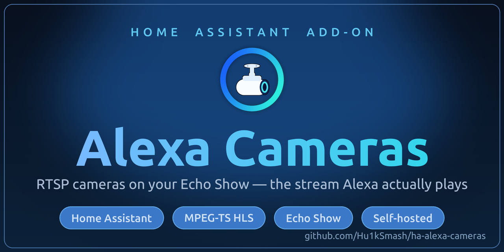

<p align="center">
  
</p>

# Home Assistant Add-on: Alexa Cameras (HLS)

Serve any RTSP camera to **Amazon Echo Show / Alexa** as a stream Alexa will
actually play — H.264 Baseline, MPEG-TS HLS (HTTP Live Streaming), read **directly from the camera**
(no go2rtc in the media path, no Nabu Casa). It can also **mix spoken announcements
into a camera's audio track**, so an alert plays *through* the live camera view on the
Echo instead of the usual Alexa announcement that tears the view down (see the
**[Documentation](alexa_cameras/DOCS.md)** for setup).

> **This add-on is one piece of a larger, fully self-hosted solution.** For the
> complete build — the Alexa Smart Home skill, the AWS Lambda camera override,
> and the Cloudflare Tunnel — follow **[docs/END-TO-END-SETUP.md](docs/END-TO-END-SETUP.md)**.
> That **[guide](docs/END-TO-END-SETUP.md)** is step-by-step and self-contained.

## Contents

- [The problem: black screen on the Echo Show](#the-problem-black-screen-on-the-echo-show)
- [What Alexa's camera relay actually requires](#what-alexas-camera-relay-actually-requires)
- [Why go2rtc's HLS produces a black screen](#why-go2rtcs-hls-produces-a-black-screen)
- [How this add-on fixes it](#how-this-add-on-fixes-it)
- [How the add-on works (internals)](#how-the-add-on-works-internals)
- [Where this fits — the end-to-end picture](#where-this-fits--the-end-to-end-picture)
- [Installation](#installation)
- [Documentation](#documentation)
- [License](#license)

---

## The problem: black screen on the Echo Show

You self-host a Home Assistant Alexa Smart Home skill (not Nabu Casa), you say
*"Alexa, show front porch,"* and the Echo Show says **"connecting to camera…"**
then shows a **black screen** — or **"camera isn't responding."** Frustratingly,
if you look at your logs, the Echo's relay *is* fetching your playlist and
downloading segments. The bytes flow, but nothing renders.

That happens because **Amazon's camera relay is extremely picky about the
stream**, and most "just point Alexa at go2rtc/HA" setups produce a stream that
is subtly undecodable. This add-on produces a stream that satisfies every one of
Amazon's requirements, so the Echo actually decodes and displays it.

## What Alexa's camera relay actually requires

Alexa does **not** connect the Echo Show directly to your camera. When you ask to
see a camera, Amazon's cloud fetches your stream through a relay (internally
"ACRS"). Two things about that relay matter:

- The fetcher is **old**. It identifies itself as
  `GStreamer souphttpsrc libsoup/2.48.1` and only understands **MPEG-TS HLS**.
- It comes from **AWS** — ASNs **16509** (AMAZON-02) and **14618** (AMAZON-AES).
  If a WAF/CDN challenges those requests, the relay silently fails.

Through the Alexa `CameraStreamController` (`InitializeCameraStreams`) interface,
the relay will only play a stream that is **all** of the following:

| Requirement | Detail |
|---|---|
| **Codec** | **H.264**, **Baseline or Main** profile. **No H.265/HEVC.** |
| **Container** | **MPEG-TS HLS** — a `.m3u8` playlist of `.ts` segments. **Not** fragmented-MP4 HLS, **not** LL-HLS (`#EXT-X-PART`), **not** MJPEG, **not** raw RTSP. |
| **Transport** | **HTTPS on 443** with a **valid** (publicly-trusted, non-self-signed) TLS certificate. |
| **Decodability** | Each segment must carry **in-band SPS/PPS** (the H.264 parameter sets) so a decoder can start on any segment. |
| **Reachability** | Amazon's AWS-ASN fetchers must **not** be bot-challenged/blocked. |

Miss **any single one** and you get a black screen or "not responding" — with no
useful error on the Echo.

## Why go2rtc's HLS produces a black screen

go2rtc is excellent, and its **RTSP** and **WebRTC/MSE** outputs are clean. But
its **MPEG-TS/HLS** output, in this pipeline, drops the **in-band SPS/PPS** across
an internal RTP hop. The resulting `.ts` segments reference parameter sets that
aren't in the stream, so decoders bail out:

```
non-existing PPS 0 referenced
```

The segments download perfectly and are the right codec/container — they are
simply **undecodable**, which the Echo renders as a black screen.

You can confirm this yourself: point `ffmpeg`/`ffprobe` at go2rtc's HLS output and
you'll see a flood of `non-existing PPS 0 referenced` errors; point it at go2rtc's
**RTSP** of the same camera and it decodes with **zero** errors. The bug is only
in the TS mux, and only across that hop.

## How this add-on fixes it

Instead of relying on go2rtc's HLS, this add-on runs a **dedicated single-process
`ffmpeg` pipeline per camera** that produces a proper MPEG-TS HLS stream:

- The `mpegts` muxer **re-emits SPS/PPS in-band** in every segment → decodable.
- **Clean, constant-rate timestamps** and short, forced keyframes → each segment
  is independently decodable, and startup is fast.
- For H.265 cameras, it **transcodes to H.264 Baseline** so Alexa can play it.

The output is exactly what Amazon's relay expects, so the Echo Show decodes and
displays it. Because ffmpeg reads the camera's RTSP **directly**, there is no
go2rtc muxing hop to drop parameter sets.

## How the add-on works (internals)

```
RTSP camera ──► ffmpeg (per camera) ──► /tmp/hls/<name>/*.ts + stream.m3u8
                                        └► snapshot.jpg
                          Python http.server :8888  ──►  /<name>/stream.m3u8
                                                          /<name>/snapshot.jpg
```

- **Reads each camera's RTSP directly** — no go2rtc in the media path.
- **Per-camera mode:**
  - **`copy`** — source is already H.264 (Baseline/Main): ffmpeg only **remuxes**
    into MPEG-TS. Near-zero CPU. Use this whenever you can.
  - **`transcode`** — source is H.265/HEVC (or otherwise incompatible): ffmpeg
    scales to 720p and **encodes H.264 Baseline**. ~0.3–0.5 core per camera.
    (Resolution / fps / bitrate are tunable, globally or per camera.)
- **The ffmpeg command** (per camera loop, simplified):
  ```
  ffmpeg -nostdin -loglevel error -fflags nobuffer -flags low_delay \
    -rtsp_transport tcp -i "rtsp://<user>:<pass>@<host>:554/<path>" \
    <copy: -c:v copy | transcode: -vf scale=1280:720,fps=15 -c:v libx264 \
       -profile:v baseline -level:v 3.1 -pix_fmt yuv420p -preset veryfast \
       -tune zerolatency -g 15 -keyint_min 15 -force_key_frames expr:gte(t,n_forced*1) -bf 0> \
    -c:a aac -ar 48000 -ac 2 -b:a 64k \
    -f hls -hls_time 1 -hls_list_size 4 \
    -hls_flags delete_segments+omit_endlist+independent_segments \
    -hls_segment_type mpegts -hls_allow_cache 0 \
    -hls_segment_filename /tmp/hls/<name>/seg_%05d.ts /tmp/hls/<name>/stream.m3u8
  ```
- **Serving:** a tiny Python `http.server` on **:8888** serves
  `/<name>/stream.m3u8`, the `.ts` segments, and `/<name>/snapshot.jpg`. For a camera marked
  `on_demand`, each request also signals the per-camera worker so an idle source (e.g. Frigate
  birdseye) is **connected to only while something is actually watching**.
- **Robustness:** each camera runs in a restart loop with **exponential backoff**
  (3s → 60s) so a wrong password can't hammer a camera into an auth-lockout;
  ffmpeg's stderr is surfaced (per-camera prefixed) into the add-on **Log**.
- **Stall watchdog:** the other failure mode is an ffmpeg that keeps *running* but
  stops producing (a frozen mux). If a camera's playlist stops advancing (~60s), only
  **that camera's** worker is restarted (up to 3×, then a one-time warning) — never the
  whole add-on, never the other cameras.
- **Announce through a camera (optional):** a small injector on **:8790** can splice a
  TTS/audio clip into a camera's audio track (`audio_source: inject` / `inject_mix`), so
  an Alexa announcement plays *over* the live view instead of tearing it down. See
  [`alexa_cameras/DOCS.md`](alexa_cameras/DOCS.md).
- **Latency:** 1-second segments. Amazon's relay does **not** support LL-HLS, so
  ~3 seconds glass-to-glass is the practical floor.

See **[`alexa_cameras/DOCS.md`](alexa_cameras/DOCS.md)** for every configuration
option, `copy` vs `transcode`, and the `url` override (e.g. Frigate birdseye).

## Where this fits — the end-to-end picture

This add-on **only** produces the Alexa-compatible stream. The full path is:

```
 Camera (RTSP, H.264/H.265)
    │
    ▼
 THIS ADD-ON  ──►  H.264 Baseline MPEG-TS HLS on http://<ha-host>:8888/<name>/stream.m3u8
    │
    ▼
 Cloudflare Tunnel  ──►  https://<your-domain>/<name>/stream.m3u8   (valid TLS cert)
    │                     (+ WAF rule locking the camera host to AWS ASNs 16509/14618)
    ▼
 AWS Lambda (your self-hosted Alexa Smart Home skill)
    │   • proxies normal directives to HA's /api/alexa/smart_home
    │   • intercepts Alexa.CameraStreamController InitializeCameraStreams
    │     and returns https://<your-domain>/<name>/stream.m3u8 as the camera URI
    ▼
 Alexa cloud relay (ACRS)  ──►  Echo Show
```

The **other four pieces** (skill, Lambda + camera override, account linking,
Cloudflare Tunnel + WAF) are documented step-by-step in
**[docs/END-TO-END-SETUP.md](docs/END-TO-END-SETUP.md)**.

## Installation

[](https://my.home-assistant.io/redirect/supervisor_add_addon_repository/?repository_url=https%3A%2F%2Fgithub.com%2FHu1kSmash%2Fha-alexa-cameras)

**One click** with the button above adds this repository to your Home Assistant. Or add
it manually:

1. In Home Assistant: **Settings → Add-ons → Add-on Store → ⋮ → Repositories**
   and add:

   ```
   https://github.com/Hu1kSmash/ha-alexa-cameras
   ```

2. Install **Alexa Cameras (HLS)** from the store, then **Start** it.
3. Click **Open Web UI** and use the **Configuration** tab to set your **Home
   Assistant IP** and add your cameras — see
   [`alexa_cameras/DOCS.md`](alexa_cameras/DOCS.md). Configuration lives in the add-on's
   **own Web UI**, *not* the Home Assistant *Options* tab.
4. Each camera is served at:
   - `http://<host>:8888/<name>/stream.m3u8`
   - `http://<host>:8888/<name>/snapshot.jpg`
5. **Continue in the [add-on documentation](alexa_cameras/DOCS.md)** — it walks you through
   configuring the add-on, and from there on to the end-to-end setup guide (HTTPS + the Alexa
   skill).

## Documentation

Everything about running the add-on lives in the docs — this README is just the overview.

- **[Add-on documentation](alexa_cameras/DOCS.md)** — **start here after installing.** Configure
  and run the add-on: full settings reference, `copy` vs `transcode`, finding your camera's RTSP
  path, the Web UI tabs, audio injection (announce *through* a camera), the birdseye auto-show
  recipe, bulk-cleaning stale Alexa devices, and troubleshooting.
- **[End-to-end setup guide](docs/END-TO-END-SETUP.md)** — the rest of the self-hosted path
  around the add-on: Cloudflare Tunnel + WAF, the Alexa Smart Home skill, and the AWS Lambda
  camera override. (The add-on docs link you here when you're ready.)

## Support

Questions, bug reports, and feature requests → please
[open an issue on GitHub](https://github.com/Hu1kSmash/ha-alexa-cameras/issues). That's the
best way to reach the maintainer and keep the answer searchable for others.

---

<sub>© 2026 Tom Hirt · Licensed under Apache-2.0 (see [LICENSE](LICENSE) and [NOTICE](NOTICE)) · [github.com/Hu1kSmash/ha-alexa-cameras](https://github.com/Hu1kSmash/ha-alexa-cameras)</sub>

<sub>**Third-party:** the example AWS Lambda in the [end-to-end setup guide](docs/END-TO-END-SETUP.md) is derived from the community Home Assistant Alexa Smart Home Lambda by Jason Hu and Matthew Hilton, also under Apache-2.0 (see the attribution header in that code block).</sub>
