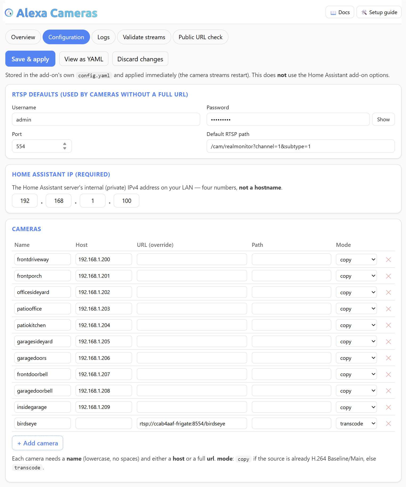
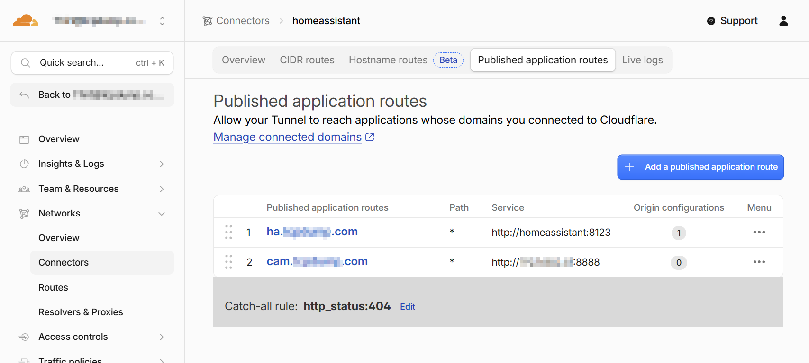
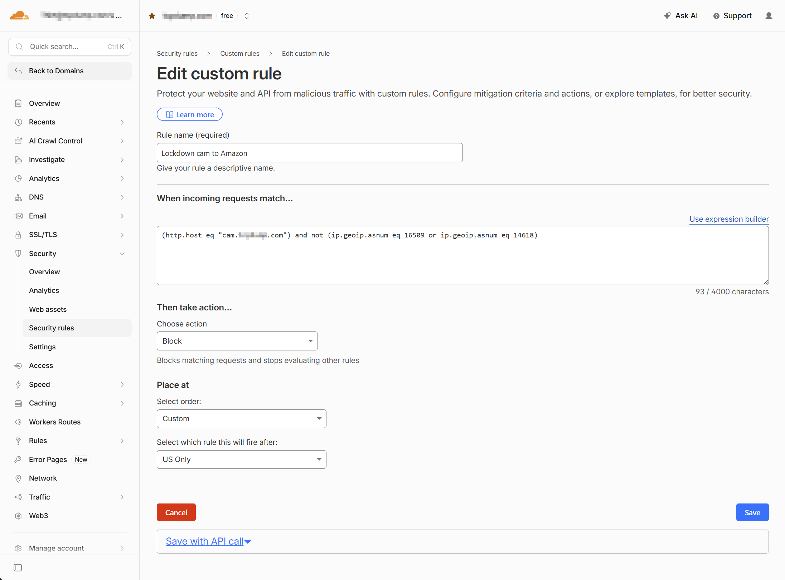
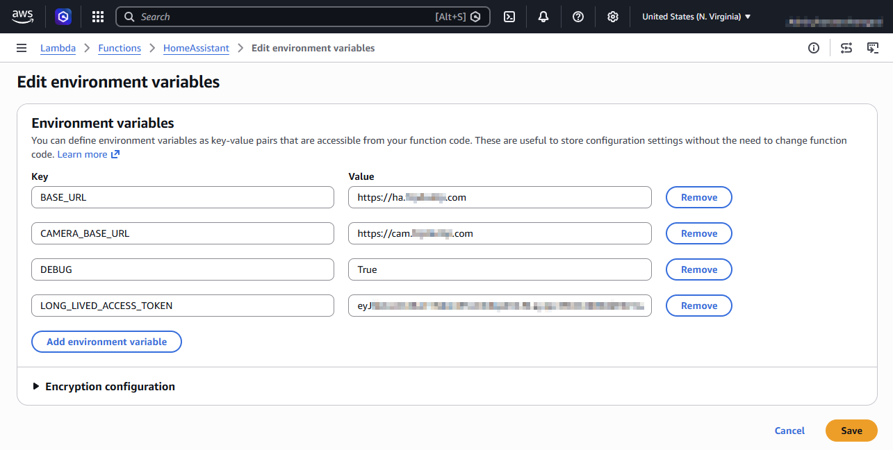
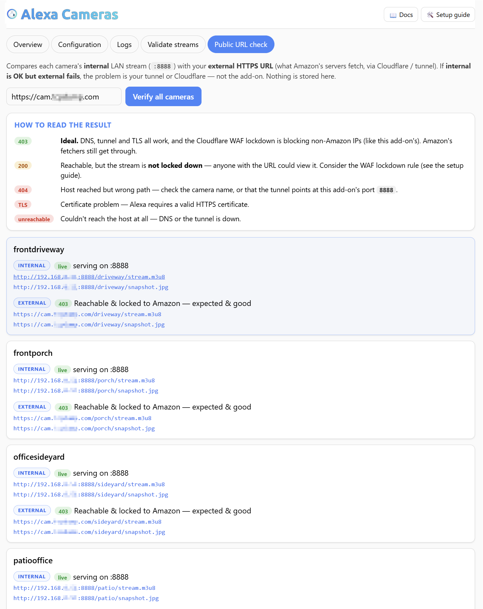

<p align="center">
  
</p>

# End-to-End Setup: Frigate/RTSP cameras on Amazon Echo Show (fully self-hosted)

This guide builds the **complete** solution for *"Alexa, show &lt;camera&gt;"* on an
Echo Show, with **no Nabu Casa** and no third-party camera cloud. The
[Alexa Cameras (HLS) add-on](../README.md) is one of five pieces; this document
wires up the other four and ties everything together.

> **Before you start here, do two things:**
>
> 1. **Read the [README](../README.md)** for *why* the stream has to look the way it
>    does (Alexa's relay only plays H.264 Baseline MPEG-TS HLS over HTTPS with in-band
>    SPS/PPS). This guide assumes you understand that constraint.
> 2. **Install and configure the add-on itself, using its [DOCS.md](../alexa_cameras/DOCS.md).**
>    Add your cameras in the add-on's Web UI, pick `copy` vs `transcode`, and get every
>    camera reading **green on the Validate streams tab** — i.e. `http://<ha-host>:8888/<name>/stream.m3u8`
>    is live, decodable H.264 **on your LAN** — *before* you touch anything below.
>
> This guide only wires the add-on's already-working local stream out to Alexa (HTTPS
> tunnel, WAF, skill/Lambda). If the add-on isn't serving a good stream on `:8888` first,
> none of the external steps here can fix that — so get that part solid, then come back.

## Quick start

The whole build as a checklist — each item links to its full section.
**You must already have a working Cloudflare tunnel to Home Assistant and a working
self-hosted Alexa Smart Home skill** (see [Prerequisites](#prerequisites)).

1. **[Add-on](#1-the-add-on-recap)** — install Alexa Cameras (HLS), add your
   cameras, confirm `http://<ha-host>:8888/<name>/stream.m3u8` is **decodable H.264**.
2. **[Tunnel route](#2-cloudflare-tunnel--expose-the-add-on-over-https)** — route a
   camera subdomain through your existing Cloudflare tunnel to `<ha-host>:8888`
   (your HA server's LAN IP).
3. **[WAF](#3-cloudflare-waf--lock-the-camera-host-to-amazon-only)** — lock the camera
   host to Amazon's AWS ASNs (**16509 / 14618**) only; everyone else is blocked.
4. **[Lambda](#4-the-alexa-smart-home-skill--aws-lambda)** — add the
   `CameraStreamController` override + `CAMERA_BASE_URL` env var to your existing
   Alexa Smart Home Lambda.
5. **[HA config](#5-home-assistant-configuration)** — expose the cameras, exclude
   clutter, name them; restart HA; *"Alexa, discover devices."*
6. **[Test](#6-test-the-whole-chain)** — *"Alexa, show camera &lt;name&gt;."*

---

## Architecture

```
 Camera (RTSP)
    │  H.264 or H.265
    ▼
 [1] Alexa Cameras (HLS) add-on            http://<ha-host>:8888/<name>/stream.m3u8
    │  H.264 Baseline MPEG-TS HLS
    ▼
 [2] Cloudflare Tunnel                      https://<your-domain>/<name>/stream.m3u8
    │  valid TLS cert on 443
    │  [3] Cloudflare WAF: lock cam host to AWS ASN 16509 / 14618 only
    ▼
 [4] AWS Lambda  =  your self-hosted Alexa Smart Home skill
    │   • normal directives  → proxied to HA  https://<HA_URL>/api/alexa/smart_home
    │   • InitializeCameraStreams → returns the add-on's HLS URL (override)
    ▼
 [5] Home Assistant  (alexa: smart_home, exposes camera entities + names)
    ▼
 Alexa cloud relay (ACRS)  →  Echo Show
```

## Prerequisites

This guide covers **only the camera-specific pieces**. Two things must **already be
set up and working** before you start — and **issues with either belong to their own
project, not this add-on:**

- ✅ **A working Cloudflare Tunnel to Home Assistant**, via the community
  **[Cloudflared add-on](https://github.com/homeassistant-apps/app-cloudflared)** —
  i.e. you can already reach HA at `https://ha.<your-domain>` with a valid
  certificate. *Tunnel setup/problems → the
  [Cloudflared add-on](https://github.com/homeassistant-apps/app-cloudflared) project.*
- ✅ **A working self-hosted Alexa Smart Home skill**, via the official
  **[Home Assistant Alexa Smart Home integration](https://www.home-assistant.io/integrations/alexa.smart_home/)**
  (your own AWS Lambda + account linking) — i.e. *"Alexa, turn on &lt;a light&gt;"*
  already works. *Skill / Lambda / account-linking setup/problems → the
  [Home Assistant Alexa Smart Home docs](https://www.home-assistant.io/integrations/alexa.smart_home/)
  and community.*

Plus:

- The **Alexa Cameras (HLS) add-on** installed and serving on your LAN (see the
  [README](../README.md)).
- Your **domain on Cloudflare** and the **Amazon Developer / AWS accounts** you
  already used for the skill above.

> **If `https://ha.<your-domain>` and *"Alexa, turn on a light"* don't already both
> work, stop and get those working first** using the two links above. Everything
> below only *adds cameras* on top of a working tunnel + skill.

Throughout, replace:
- `<your-domain>` → your public hostname for the add-on, e.g. `cam.example.com`
- `<ha-host>` → your Home Assistant server's **LAN IP**, e.g. `192.168.1.100`
- `<HA_URL>` → your Home Assistant external URL, e.g. `https://ha.example.com`

---

## [1] The add-on (recap)

Already covered in the [README](../README.md). Confirm it works on your LAN before
continuing — from another machine:

```bash
curl -s -o /dev/null -w "%{http_code}\n" http://<ha-host>:8888/<name>/stream.m3u8   # expect 200
```

And confirm the stream is **decodable H.264** (this is the whole point):

```bash
ffprobe -v error -i http://<ha-host>:8888/<name>/stream.m3u8 \
  -show_entries stream=codec_name,profile,width,height -of default=noprint_wrappers=1
# expect: codec_name=h264, profile=Constrained Baseline (or Baseline/Main)

ffmpeg -v error -i http://<ha-host>:8888/<name>/stream.m3u8 -t 4 -f null -
# expect: NO output (no "non-existing PPS 0 referenced")
```

> **Prefer no CLI?** The add-on's **Web UI** does all of this: the **Validate streams**
> tab checks each camera's source + output, and once the tunnel + Lambda are up the
> **Public URL check** tab tests the external URL (a **403** there = reachable +
> WAF-locked, which is what you want). And when you get to the test, the **Logs** tab
> shows a `GET /<name>/stream.m3u8` from a **`172.x`** address the moment Amazon's relay
> actually reaches the add-on — the fastest way to tell "black Echo" apart from "not
> reaching the add-on". Remember to set the required **Home Assistant IP** in the
> Configuration tab so those links point at your real LAN address.

Configure everything in the add-on's **Web UI → Configuration** tab (the **Home
Assistant IP** is required — a private IPv4, *not* a hostname):



---

## [2] Cloudflare Tunnel — expose the add-on over HTTPS

Alexa needs your stream at **`https://<your-domain>/…`** with a **publicly-trusted
certificate**. A Cloudflare Tunnel gives you that without opening any ports.

A Cloudflare tunnel is configured **one of two mutually-exclusive ways**.
**Whichever you use, the route for your camera domain must point at THIS add-on on
port `8888`** — not at go2rtc/Frigate.

- **Add-on-managed (Option A):** the Cloudflared add-on owns the tunnel config, and
  you route the camera domain with **`additional_hosts`**.
- **Dashboard-managed (Option B):** the tunnel is configured in the Cloudflare
  dashboard, and you route the camera domain as a **Published application route**.
  In this mode **the add-on's `additional_hosts` is ignored** — the dashboard wins.

> **If your `additional_hosts` "does nothing," you're in dashboard-managed mode.**
> Cloudflare sometimes auto-upgrades tunnels to dashboard-managed; when it does, the
> add-on's `additional_hosts` becomes inert and you must define the route in the
> dashboard (Option B). Don't run both — pick the one matching your tunnel.

### Option A — the Cloudflared Home Assistant add-on (add-on-managed tunnel)

The community **[Cloudflared add-on](https://github.com/homeassistant-apps/app-cloudflared/tree/main)**
creates and manages the tunnel for you. Follow **its own documentation** for the
base setup (creating the tunnel, exposing Home Assistant itself):

**→ https://github.com/homeassistant-apps/app-cloudflared/tree/main**

The **only** thing you add for camera streaming is a single
[`additional_hosts`](https://github.com/homeassistant-apps/app-cloudflared/blob/main/cloudflared/DOCS.md#option-additional_hosts)
entry that routes your camera subdomain to the Alexa Cameras add-on:

```yaml
additional_hosts:
  - hostname: cam                        # your <your-domain> subdomain (e.g. cam.example.com)
    service: http://<ha-host>:8888       # your HA server's LAN IP, e.g. http://192.168.1.100:8888
```

> ⚠️ Use your **Home Assistant server's LAN IP** for the `:8888` target — the add-on
> publishes port 8888 on the host. **Do not** use the `homeassistant` hostname; that
> resolves to HA Core (port **8123**) and does not serve the add-on. And it must be
> **`:8888` (this add-on)** — pointing it at Frigate's go2rtc (`:1984`) serves the
> broken HLS this add-on exists to replace (black screen).

### Option B — a dashboard-managed tunnel

1. **Cloudflare dashboard → Zero Trust → Networks → Tunnels → Create a tunnel**
   (type: *Cloudflared*). Name it, save.
2. Install the connector it shows you. Confirm the tunnel shows **HEALTHY**.
3. **Published application routes → Add a public hostname:**
   - **Subdomain/domain:** `<your-domain>` (e.g. `cam` + `example.com`)
   - **Service:** `HTTP` → **your HA server's LAN IP** + `:8888`, e.g.
     `192.168.1.100:8888` *(this add-on)*. **Do not** use the `homeassistant`
     hostname — that's HA Core (8123), not the add-on.
4. Cloudflare automatically issues a valid TLS cert for `<your-domain>`.

Your published routes should look like this — the camera host (`cam.…`) points at
your **HA server's LAN IP on `:8888`** (the add-on), while HA itself is a separate
route:



> **Dashboard vs add-on config:** if a tunnel is managed from the Cloudflare
> dashboard, the dashboard's routes **take precedence** and the add-on's
> `additional_hosts` may be ignored. Make sure the route you actually rely on is the
> one pointing at `:8888`.

Verify from anywhere:

```bash
curl -s -o /dev/null -w "%{http_code}\n" https://<your-domain>/<name>/stream.m3u8
```

> If you also expose Home Assistant itself through Cloudflare, keep that on its own
> hostname (e.g. `ha.example.com`). The add-on hostname (`<your-domain>`) only
> needs to route to `:8888`.

---

## [3] Cloudflare WAF — lock the camera host to Amazon only

The camera host needs two things, and **one rule handles both**:

- **Security.** The streams are served with **no authentication**
  (`authorizationType: NONE`) — anyone who learns
  `https://<your-domain>/<name>/stream.m3u8` could watch your cameras.
- **Delivery.** Amazon's relay fetches from **AWS** (ASNs **16509** AMAZON-02 and
  **14618** AMAZON-AES), and must not be blocked or bot-challenged.

Add a Cloudflare custom rule that **blocks every request to the camera host that
isn't from Amazon's fetchers** — locking the endpoint down to Amazon only:

1. **Cloudflare dashboard → your domain → Security → Security rules → Custom rules →
   Create rule.** Name it e.g. `Lockdown cam to Amazon`.
2. **Expression** (use the expression editor):
   ```
   (http.host eq "<your-domain>") and not (ip.geoip.asnum eq 16509 or ip.geoip.asnum eq 14618)
   ```
3. **Action: `Block`.** Deploy.

Now only Amazon's AWS ASNs can reach your camera host — everyone else gets a 403,
and Amazon's relay (which the rule does **not** match) passes straight through.



> **Also check Bot Fight Mode.** On the free plan, Cloudflare's Bot Fight Mode can
> *independently* challenge AWS datacenter IPs and still cause a black screen, even
> with the rule above (the rule doesn't match Amazon, so Amazon continues on to bot
> protection). If a *"show camera"* fails, open **Security → Events**: a **Managed
> Challenge / 403 from an AWS ASN** hitting `/…/stream.m3u8` is Bot Fight Mode —
> turn it off for this zone (or on paid plans add a Skip rule for those ASNs).

> **Testing note:** because the host is locked to Amazon, **your own browser gets a
> 403** on `https://<your-domain>/<name>/stream.m3u8` — that block *is the rule
> working*. Test the actual stream from the LAN instead (`http://<ha-host>:8888/…`).

---

## [4] The Alexa Smart Home skill + AWS Lambda

The skill, the AWS Lambda, the Login with Amazon security profile, and account
linking are the **standard Home Assistant self-hosted Alexa Smart Home setup**.
Don't reinvent it — follow the official, continuously-maintained guide end to end:

### → **[Home Assistant: Alexa Smart Home](https://www.home-assistant.io/integrations/alexa.smart_home/)**

Everything in that guide applies as written. **Only two things are different** for
camera streaming:

### Difference 1 — use this Lambda code (it adds the camera override)

Where the HA guide has you paste its Lambda function, paste **this** instead. It's
the same "proxy directives to Home Assistant" Lambda, **plus** a
`CameraStreamController` override: when Alexa asks to initialize a camera stream,
it returns the **add-on's** H.264 MPEG-TS HLS URL instead of HA's built-in
(fragmented-MP4 / LL-HLS) stream — which is the whole reason the Echo can decode
it. It also folds in the robustness of the community HA Smart Home Lambda
([Jason Hu / Matthew Hilton](https://gist.github.com/matt2005/744b5ef548cc13d88d0569eea65f5e5b),
Apache-2.0): request validation, **structured Alexa error responses** (a clean
failure instead of a Lambda crash on an HA error), redacted debug logging, and an
optional self-signed-cert toggle. Fill in `CAMERA_MAP` with one entry per camera
you serve from the add-on.

> **Auth model — leave it as-is unless you know you changed it.** This Lambda uses
> your **`LONG_LIVED_ACCESS_TOKEN`** for every proxied request, which is the setup
> this guide (and the HA "Login with Amazon" account-linking) describes. Only set
> the new `USE_DIRECTIVE_TOKEN=True` env var if you deliberately linked the Alexa
> skill to **Home Assistant's own OAuth** — otherwise the token Alexa sends can't be
> validated by HA and every command returns 401. When in doubt, don't set it.

```python
import json
import logging
import os
import uuid
from typing import Any, Optional

import urllib3

# ---- configuration (environment variables) ----------------------------------
DEBUG = os.environ.get("DEBUG", "False").lower() in ("1", "true", "yes")

BASE_URL = os.environ.get("BASE_URL", "").rstrip("/")                 # https://ha.example.com
CAMERA_BASE_URL = os.environ.get("CAMERA_BASE_URL", "").rstrip("/")   # https://cam.example.com
LONG_LIVED_ACCESS_TOKEN = os.environ.get("LONG_LIVED_ACCESS_TOKEN")

# Auth model:
#   default   -> use LONG_LIVED_ACCESS_TOKEN for every proxied request. This is this
#                project's documented setup (Alexa account-linking via Login with Amazon,
#                HA reached with a long-lived token) and is what keeps existing installs working.
#   opt-in    -> set USE_DIRECTIVE_TOKEN=True ONLY if you linked the Alexa skill to Home
#                Assistant's OWN OAuth; then the bearer token Alexa puts in each directive is
#                used, with the long-lived token as a fallback.
USE_DIRECTIVE_TOKEN = os.environ.get("USE_DIRECTIVE_TOKEN", "False").lower() in ("1", "true", "yes")

# TLS verification for the call to Home Assistant. Leave ON (default). Only set
# NOT_VERIFY_SSL=True if HA sits behind a self-signed cert (not needed with Cloudflare).
VERIFY_SSL = os.environ.get("NOT_VERIFY_SSL", "False").lower() not in ("1", "true", "yes")

# ---- logging ----------------------------------------------------------------
_logger = logging.getLogger("ha-alexa-cameras")
_logger.setLevel(logging.DEBUG if DEBUG else logging.INFO)
if not _logger.handlers:
    _handler = logging.StreamHandler()
    _handler.setFormatter(logging.Formatter(
        "%(asctime)s - %(name)s - %(levelname)s - [%(filename)s:%(lineno)d] - %(message)s"))
    _logger.addHandler(_handler)
logging.getLogger("urllib3").setLevel(logging.INFO)

# ---- HTTP client (built once, reused across warm invocations) ---------------
http = urllib3.PoolManager(
    cert_reqs="CERT_REQUIRED" if VERIFY_SSL else "CERT_NONE",
    timeout=urllib3.Timeout(connect=2.0, read=10.0),
)

# Map each camera's Home Assistant entity -> its add-on stream name.
#   KEY   = the HA entity's object_id, i.e. the part after "camera." (Alexa sends it as
#           the endpointId "camera#<object_id>"). So camera.driveway -> key "driveway".
#   VALUE = the add-on camera `name` -- the URL segment served at
#           https://<your-domain>/<name>/stream.m3u8. The add-on enforces this to lowercase
#           letters/numbers/underscore (no spaces/capitals), the same character set HA uses
#           for entity object_ids.
# Easiest: name the add-on camera exactly like the HA entity's object_id, so key == value.
# (What Alexa *speaks* is the entity's friendly name -- set separately via entity_config below.)
# These names match the "Example configuration" in alexa_cameras/DOCS.md.
CAMERA_MAP = {
    "driveway": "driveway",
    "porch": "porch",
    "sideyard": "sideyard",
    "garage": "garage",
    "birdseye": "birdseye",     # only if you set up the birdseye follow-cam (bonus)
    # ...one line per camera you serve from the add-on...
}


def _alexa_error(error_type: str, message: str) -> dict:
    """Minimal Alexa error event, so a failure shows cleanly instead of crashing the Lambda."""
    return {"event": {"payload": {"type": error_type, "message": message}}}


def _redacted(event: dict) -> str:
    """Serialize an event for logging with any bearer token masked (tokens ride in the directive)."""
    try:
        clone = json.loads(json.dumps(event))
        directive = clone.get("directive", {})
        for holder in (directive.get("endpoint", {}).get("scope"),
                       directive.get("payload", {}).get("grantee"),
                       directive.get("payload", {}).get("scope")):
            if isinstance(holder, dict) and "token" in holder:
                holder["token"] = "***REDACTED***"
        return json.dumps(clone)
    except Exception:
        return "<unserializable event>"


def _camera_stream_override(event: dict) -> Optional[dict]:
    """If this is InitializeCameraStreams for a mapped camera, answer with the
    add-on's HLS URL. Otherwise return None to fall through to the HA proxy."""
    directive = event.get("directive", {})
    header = directive.get("header", {})
    if (header.get("namespace") != "Alexa.CameraStreamController"
            or header.get("name") != "InitializeCameraStreams"):
        return None

    endpoint_id = directive.get("endpoint", {}).get("endpointId", "")
    key = endpoint_id.split("#", 1)[1] if "#" in endpoint_id else endpoint_id
    cam = CAMERA_MAP.get(key)
    if not cam:
        return None

    return {
        "event": {
            "header": {
                "namespace": "Alexa.CameraStreamController",
                "name": "Response",
                "payloadVersion": "3",
                "messageId": str(uuid.uuid4()),
                "correlationToken": header.get("correlationToken"),
            },
            "endpoint": {"endpointId": endpoint_id},
            "payload": {
                "cameraStreams": [{
                    "uri": f"{CAMERA_BASE_URL}/{cam}/stream.m3u8",
                    "protocol": "HLS",
                    "resolution": {"width": 1280, "height": 720},
                    "authorizationType": "NONE",
                    "videoCodec": "H264",
                    "audioCodec": "AAC",
                }],
                "imageUri": f"{CAMERA_BASE_URL}/{cam}/snapshot.jpg",
            },
        }
    }


def _resolve_token(directive: dict) -> Optional[str]:
    """Choose the bearer token to send to HA (see USE_DIRECTIVE_TOKEN)."""
    if not USE_DIRECTIVE_TOKEN:
        return LONG_LIVED_ACCESS_TOKEN
    # Account-linking mode: token rides in endpoint.scope, payload.grantee (AcceptGrant),
    # or payload.scope (Discovery).
    scope = (directive.get("endpoint", {}).get("scope")
             or directive.get("payload", {}).get("grantee")
             or directive.get("payload", {}).get("scope"))
    token = scope.get("token") if isinstance(scope, dict) else None
    return token or LONG_LIVED_ACCESS_TOKEN


def lambda_handler(event: dict[str, Any], context: Any) -> dict[str, Any]:
    if DEBUG:
        _logger.debug("Event: %s", _redacted(event))

    try:
        # 1) Camera stream requests -> answer locally with the add-on's HLS URL.
        #    (Runs before any auth/validation, so camera streaming works even if the
        #     HA proxy is misconfigured.)
        cam_response = _camera_stream_override(event)
        if cam_response is not None:
            _logger.info("Served camera stream override")
            return cam_response

        # 2) Everything else -> proxy to Home Assistant. Validate first so a malformed
        #    request returns a clean Alexa error instead of a stack trace.
        if not BASE_URL:
            raise ValueError("BASE_URL environment variable must be set")

        directive = event.get("directive")
        if directive is None:
            raise ValueError("Malformed request: missing 'directive'")
        payload_version = directive.get("header", {}).get("payloadVersion")
        if payload_version != "3":
            raise ValueError(f"Unsupported payloadVersion {payload_version!r} (expected '3')")

        token = _resolve_token(directive)
        if not token:
            raise ValueError("No access token (set LONG_LIVED_ACCESS_TOKEN, or enable USE_DIRECTIVE_TOKEN)")

        response = http.request(
            "POST",
            f"{BASE_URL}/api/alexa/smart_home",
            headers={
                "Authorization": f"Bearer {token}",
                "Content-Type": "application/json",
            },
            body=json.dumps(event).encode("utf-8"),
        )

        if response.status >= 400:
            body = response.data.decode("utf-8", "replace")
            _logger.error("Home Assistant returned %s: %s", response.status, body[:500])
            error_type = ("INVALID_AUTHORIZATION_CREDENTIAL"
                          if response.status in (401, 403) else "INTERNAL_ERROR")
            return _alexa_error(error_type, f"Home Assistant responded {response.status}")

        _logger.info("Proxied to Home Assistant OK (%s)", response.status)
        return json.loads(response.data.decode("utf-8"))

    except (ValueError, KeyError, json.JSONDecodeError) as e:
        _logger.exception("Bad request")
        return _alexa_error("INVALID_REQUEST", str(e))
    except urllib3.exceptions.HTTPError:
        _logger.exception("Network error talking to Home Assistant")
        return _alexa_error("ENDPOINT_UNREACHABLE", "Could not reach Home Assistant")
    except Exception:
        _logger.exception("Unexpected error")
        return _alexa_error("INTERNAL_ERROR", "An unexpected error occurred")
```

> HA still advertises the `CameraStreamController` capability during discovery, so
> discovery and camera **naming** come from HA as normal. This override only
> replaces the stream **URL** at playback time.

### Difference 2 — add the `CAMERA_BASE_URL` environment variable

The HA guide has you set `BASE_URL`, `LONG_LIVED_ACCESS_TOKEN`, and `DEBUG`. Add
**one more** — `CAMERA_BASE_URL`, the add-on's public HTTPS base (the Cloudflare
Tunnel hostname from step [2]). Your Lambda's environment variables should look like
this:



| Key | Required | Value |
|---|---|---|
| `BASE_URL` | **Yes** | your Home Assistant external URL, e.g. `https://ha.example.com` |
| `CAMERA_BASE_URL` | **Yes** | the add-on's public base from step [2], e.g. `https://cam.example.com` |
| `LONG_LIVED_ACCESS_TOKEN` | **Yes** | a Home Assistant Long-Lived Access Token (HA → profile → Security → Create Token) |
| `DEBUG` | No | `True` while setting up (verbose CloudWatch logs, with the auth token redacted); set `False` later |
| `USE_DIRECTIVE_TOKEN` | No | Leave **unset**. Set `True` only if you linked the skill to Home Assistant's own OAuth (not the Login-with-Amazon flow this guide uses) — see the auth-model note above. |
| `NOT_VERIFY_SSL` | No | Leave **unset** (HA's TLS cert is verified). Set `True` only if Home Assistant is behind a self-signed certificate — not needed with a Cloudflare Tunnel. |

Then finish the HA guide (account linking + *"Alexa, discover devices"*) and
continue to [step 5](#5-home-assistant-configuration).

---

## [5] Home Assistant configuration

The base `alexa: smart_home:` block is part of the
[HA guide](https://www.home-assistant.io/integrations/alexa.smart_home/). The
**camera-specific** additions — worth calling out because they save real pain — are
the `filter:` excludes and the `entity_config:` names:

```yaml
# Alexa/Echo camera streaming cannot handle Low-Latency HLS (EXT-X-PART / partial
# segments). Disable ll_hls so any HA-served HLS is plain HLS.
stream:
  ll_hls: false

alexa:
  smart_home:
    # ...locale / endpoint / client_id / client_secret per the HA guide...
    filter:
      include_domains:
        - camera
        # ...plus light/switch/lock/etc. for anything else you want on Alexa...
      exclude_entities:
        # Exclude camera.birdseye ONLY if you are NOT doing the birdseye follow-cam
        # (see the add-on's DOCS.md). If you ARE, INCLUDE it and name it below — the add-on
        # transcodes birdseye's H.264 High stream to Alexa Baseline, so it IS playable.
        # - camera.birdseye
        # ...any duplicate H.265 cameras that can't be Alexa-played...
      exclude_entity_globs:
        - camera.*_sub_restream    # go2rtc restream cams — collide in voice matching
    # Clean spoken Alexa names (survive re-discovery, unlike renaming in the app).
    # The entity id stays as-is; only the Alexa-facing name changes.
    entity_config:
      camera.driveway:
        name: "Driveway"
      camera.porch:
        name: "Porch"
      # ...one per camera (keys match CAMERA_MAP in the Lambda above)...
      camera.birdseye:           # only if you set up the birdseye follow-cam (bonus)
        name: "Birdseye"
```

Naming gotchas learned the hard way:

- **Default names come from Home Assistant.** Each camera shows up in Alexa exactly
  as it's named in HA — standard HA→Alexa behavior, not something this add-on
  controls. Alexa matches loosely (a one-word `Frontporch` is usually found when you
  say *"front porch"*), but for clean, reliable voice control give each camera a
  friendly spoken name via `entity_config` (above).
- **Exclude clutter cameras** so voice matching isn't ambiguous — go2rtc restream
  cameras and any duplicate integration cameras that can't be Alexa-played (H.265).
  *(Frigate `camera.birdseye` is the exception if you set up the follow-cam bonus —
  **include** it; the add-on transcodes its H.264 High stream to Alexa Baseline.)*
- **The word "doorbell"** is intercepted by Alexa — `"Alexa, show front doorbell"`
  gets swallowed because Alexa treats "doorbell" as a device concept. Either name
  doorbell cameras something else (e.g. "Front Entry") **or** use the explicit
  **`"Alexa, show camera front doorbell"`** phrasing, which routes reliably and
  dodges the interception. Teaching everyone the `show camera <name>` form is the
  most reliable habit for all cameras.
- After editing `filter:` or `entity_config:`, **restart Home Assistant** (not just
  reload) and re-run **"Alexa, discover devices."**

---

## [6] Test the whole chain

1. **Discover:** *"Alexa, discover devices"* (or Alexa app → Devices → **+**).
   Your cameras appear with the `entity_config` names.
2. **Show:** *"Alexa, show camera porch"* on an Echo Show. Expect a live view
   within ~2–4 seconds.
3. If a snapshot appears but the live view is black, work through
   [Troubleshooting](#7-troubleshooting) — it's almost always codec, cert, or WAF.

The add-on's **Public URL check** tab confirms the tunnel + WAF from Home Assistant's
side — a green **`403`** per camera is the ideal result (reachable, and locked to Amazon):



---

## [7] Troubleshooting

Work top-down; each check isolates one link in the chain.

| Symptom | Likely cause | Check / fix |
|---|---|---|
| **"I couldn't find a device called …"** | Not discovered / name mismatch | Re-discover; confirm the camera is in the `filter:`; try `"show camera <name>"`; check `entity_config` name. |
| **"…isn't responding" / black, no snapshot** | Relay can't reach the stream | Tunnel down / wrong route, **or** Bot Fight Mode challenging Amazon — Cloudflare **Security → Events**: a **Managed Challenge / 403 from an AWS ASN** on `/…/stream.m3u8` means bot protection is blocking the relay (see [WAF](#3-cloudflare-waf--lock-the-camera-host-to-amazon-only)). |
| **Snapshot shows, but live is black** | Stream is fetched but **undecodable** | `ffmpeg -v error -i https://<your-domain>/<name>/stream.m3u8 -t 4 -f null -` → `non-existing PPS 0 referenced` means it's not this add-on's output (are you pointing at go2rtc/HA HLS?). Confirm the Lambda override URL points at the add-on. |
| **Live is black; ffprobe says `hevc`** | Camera is **H.265** in `copy` mode | Set that camera to `mode: transcode` in the add-on (or set the camera's sub stream to H.264B and use `copy`). |
| **Your browser gets 403 on the public URL** | The lockdown rule working as intended | Expected — the camera host is locked to Amazon's ASNs. Test the stream from the **LAN** (`http://<ha-host>:8888/…`), not the public URL. |
| **`camera not responding`, all cameras, right after setup** | Lambda not returning the override, or `CAMERA_MAP`/`CAMERA_BASE_URL` wrong | Lambda **CloudWatch** logs (set `DEBUG=True`); confirm the `endpointId` suffix matches a `CAMERA_MAP` key and the built URL resolves. |
| **One camera 401s / add-on log shows an auth loop** | Wrong `rtsp_password` (watch `$` and other shell/URL-special chars) | Fix the password in the add-on config; the add-on backs off automatically so it won't lock the camera out. |
| **Stale/duplicate cameras in Alexa after changes** | Alexa keeps old devices | Bulk-delete + re-discover — see [DOCS → Bonus tool: bulk-clean stale Alexa devices](../alexa_cameras/DOCS.md#bonus-tool-bulk-clean-stale-alexa-devices). |

**Useful commands:**

```bash
# Is the add-on serving decodable H.264 Baseline?
ffprobe -v error -i http://<ha-host>:8888/<name>/stream.m3u8 \
  -show_entries stream=codec_name,profile,width,height -of default=noprint_wrappers=1

# Public URL from your own (non-AWS) IP: the lockdown WAF rule returns 403 — that's
# expected, and confirms the rule + tunnel are live (test the real stream on the LAN).
curl -sI https://<your-domain>/<name>/stream.m3u8   # 403 = locked to Amazon (good)

# Decode cleanliness (no PPS errors):
ffmpeg -v error -i http://<ha-host>:8888/<name>/stream.m3u8 -t 5 -f null -
```

---

## Appendix: latency & quality notes

- **~3 seconds** glass-to-glass is the practical floor: Amazon's relay does **not**
  support LL-HLS, so 1-second plain-HLS segments are as low as it goes.
- Use each camera's **sub stream** (low-res, low-bitrate) for Alexa — an Echo Show
  is small, and it keeps `copy`-mode CPU near zero. On Amcrest/Dahua, set the sub
  to **H.264B** and use `mode: copy`.
- For a single "follow the action" camera, point the add-on's per-camera `url` at a
  Frigate **birdseye** restream (`rtsp://<frigate>:8554/birdseye`, `mode: transcode`
  since birdseye is H.264 High) — see [`alexa_cameras/DOCS.md`](../alexa_cameras/DOCS.md).
